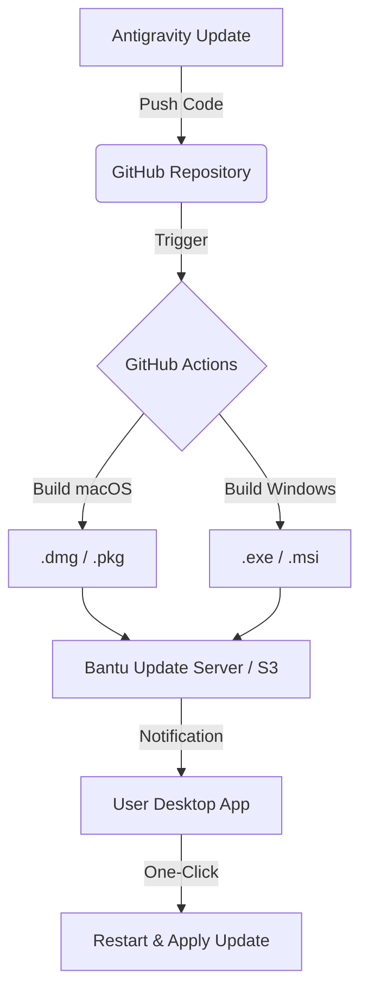

# 🖥️ Bantu Desktop: Vision & Implementation Strategy

## Overview
Bantu Desktop aims to elevate the payroll management experience from a browser tab to a dedicated, premium productivity suite. By wrapping our existing high-performance web architecture into a native container (macOS/Windows), we gain deep system integration, improved performance, and a persistent brand presence on the user's workstation.

---

## 🛠️ Technology Stack Options

| Feature | **Electron** | **Tauri 2.0** |
| :--- | :--- | :--- |
| **Engine** | Bundled Chromium | System Native Webview (Safari/Edge) |
| **App Size** | Large (~100MB+) | Tiny (~5MB - 10MB) |
| **Performance** | High Memory Usage | Optimised & Lean |
| **Maturity** | Industry Standard (VS Code, Slack) | Emerging Standard (Fastest growth) |
| **Security** | Requires careful isolation | Secure by default (Rust-based) |

> [!TIP]
> **Recommendation:** For Bantu's sleek and modern aesthetic, **Tauri** offers a faster, lighter experience that feels more like a modern macOS app. However, **Electron** is the safest bet for maximum compatibility with older Windows machines.

---

## 🚀 The Antigravity Update Pipeline
Antigravity serves as the bridge between development and live distribution.

### Key Integration Points:
1. **GitHub Actions Infrastructure:** We will configure a CI pipeline that signs your app with official Apple/Microsoft developer certificates.
2. **Auto-Updater Modules:** Implementing `electron-updater` or `tauri-plugin-updater` to handle background downloads.
3. **Draft Updates:** Antigravity can push "Alpha" versions to a specific tester group (e.g., your development team) before a general release.

---

## ✨ "Wow" Factor Features (Native Integration)

### 🔔 Smart Desktop Notifications
- Real-time alerts for "Payroll Processed Successfully."
- Critical fraud detection warnings that appear even if the app is minimized.
- Interactive notification buttons (e.g., "Approve Payroll" directly from the alert).

### 🎨 Visual Excellence
- **Vibrant Blur / Mica Effects:** Leveraging native OS transparency for a premium "glassmorphism" look that matches macOS Sonoma/Ventura and Windows 11.
- **Deep Linking:** Launching specific payrolls directly from an email link into the desktop app.

### 🔐 Hardware Security
- **Biometric Authentication:** FaceID or TouchID unlock for sensitive payroll data.
- **Local SQLite Encryption:** Encrypting sensitive session data on the user's hard drive using hardware-backed keys.

---

## 🗺️ Implementation Roadmap

### Phase 1: The Wrapper (MVP)
- Choose between Electron or Tauri.
- Basic window configuration with "Always on Top" and "Start on Boot" options.

### Phase 2: System Integration
- Tray icon with "Quick Summary" of current month's payroll.
- Native file handling for exporting PDF payslips directly to specific folders.

### Phase 3: The Update Engine
- Full automation of the build and distribution pipeline via Antigravity.
- Implement specialized "Delta" updates (only download changes to save bandwidth).

---

> [!IMPORTANT]
> **Reference Note:** This document serves as the architectural foundation for Bantu's expansion. All future desktop-related commands from Antigravity will reference this strategy.
